# Architecture Diagrams

## System Architecture Overview

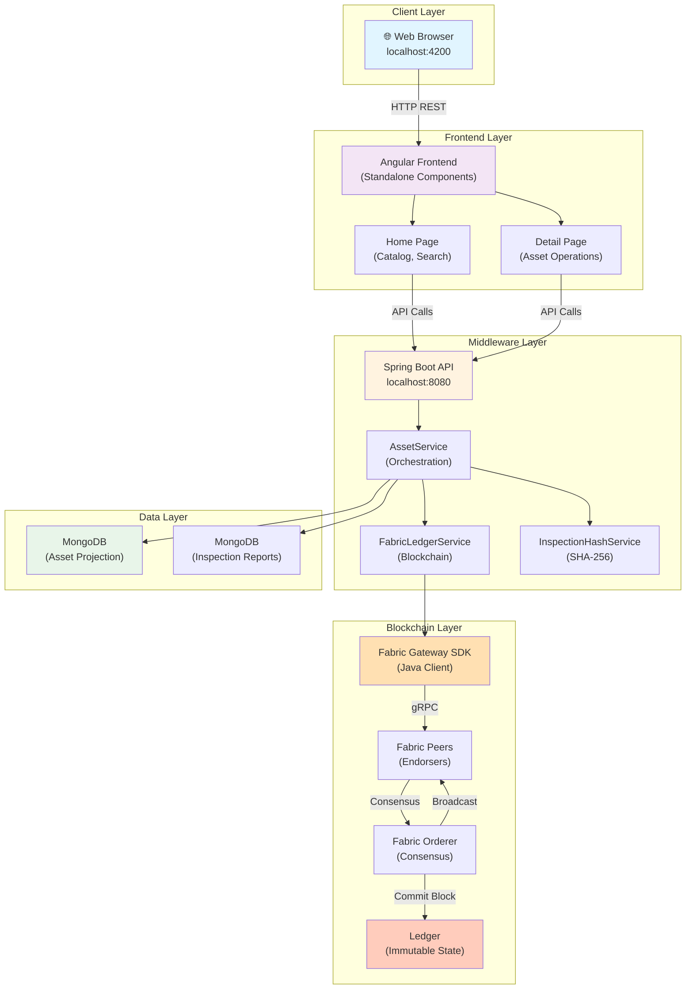

## Component Component Interaction Diagram

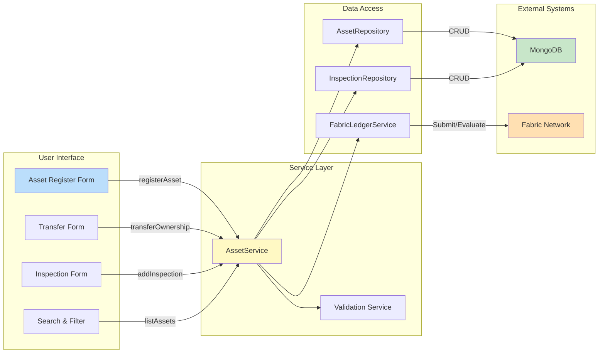

## Asset Registration Flow

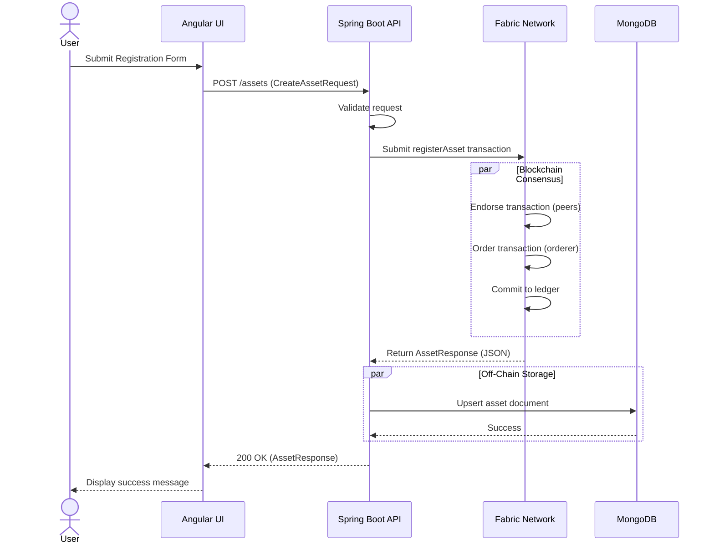

## Ownership Transfer Flow

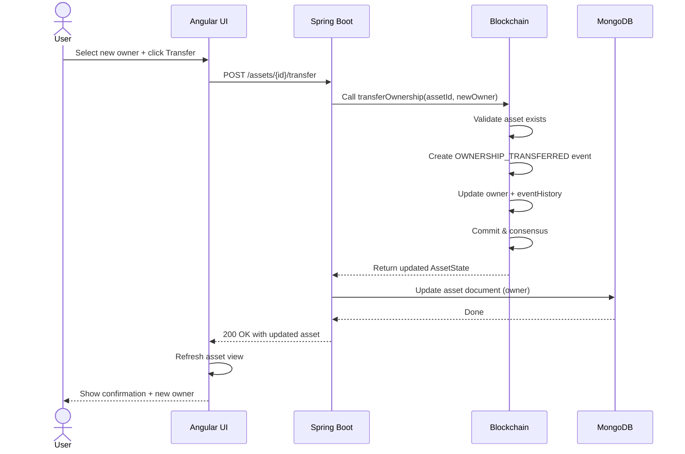

## Inspection Report Workflow

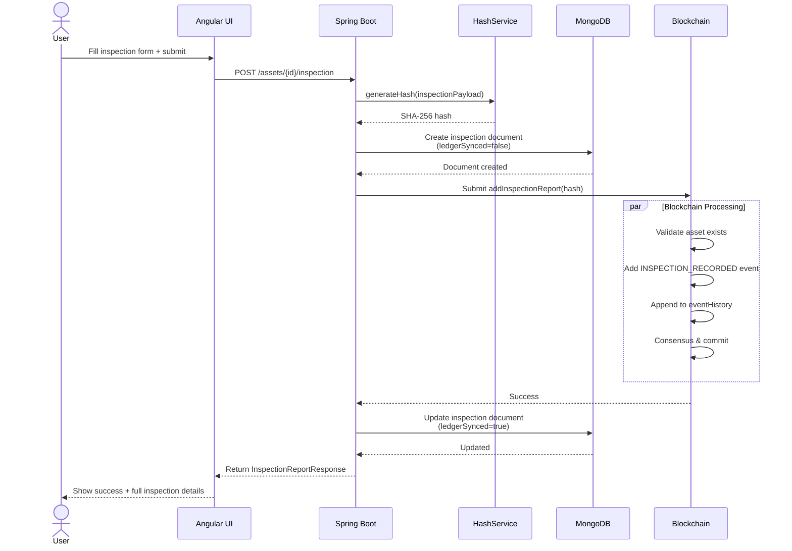

## Asset History Query Flow

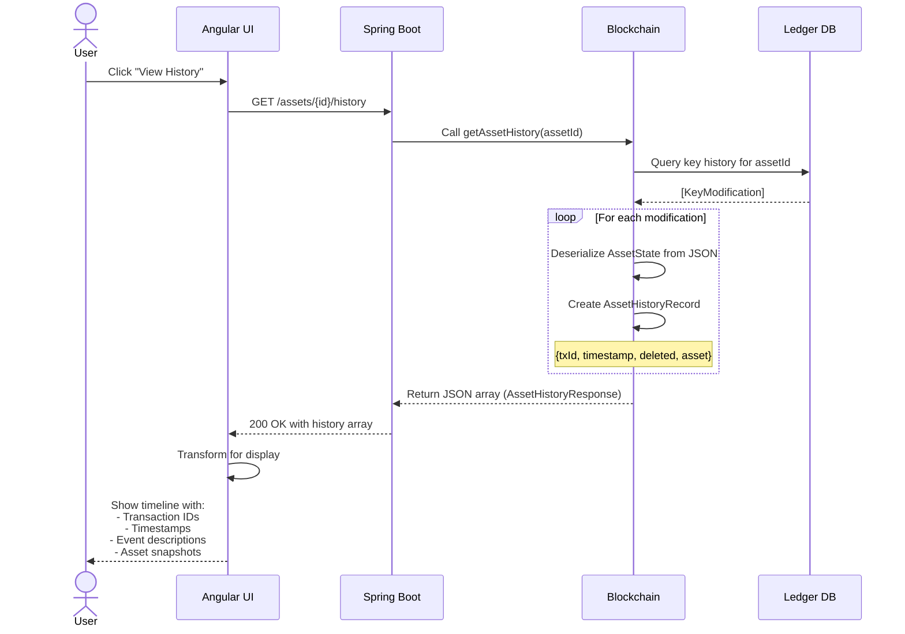

## Data Synchronization Between MongoDB and Fabric

```mermaid
stateDiagram-v2
    [*] --> Initial: Asset created
    
    Initial --> OnChain: Submit registerAsset to Fabric
    OnChain --> Consensus: Endorsement + Ordering
    Consensus --> Committed: Block committed to ledger
    Committed --> OffChainProjection: Upsert MongoDB\n(AssetDocument)
    OffChainProjection --> ConsistentState: Both systems consistent
    
    ConsistentState --> InspectionEvent: Add inspection report
    InspectionEvent --> HashGenerated: Generate SHA-256 hash
    HashGenerated --> MongoSave1: Save to MongoDB\n(ledgerSynced=false)
    MongoSave1 --> FabricSubmit: Submit hash to blockchain
    FabricSubmit --> FabricConsensus: Consensus
    FabricCommitted: Block committed
    FabricConsensus --> FabricCommitted
    FabricCommitted --> MongoSync: Update MongoDB\n(ledgerSynced=true)
    MongoSync --> SyncedState: Inspection synced
    
    SyncedState --> ListAssets: Query /assets
    ListAssets --> MongoQuery: Read from MongoDB
    MongoQuery --> FilterByFabric: Check asset exists on Fabric
    FilterByFabric --> ReturnProjection: Return filtered results
    ReturnProjection --> Frontend: Send to ng app
```

## Design Pattern Visualization

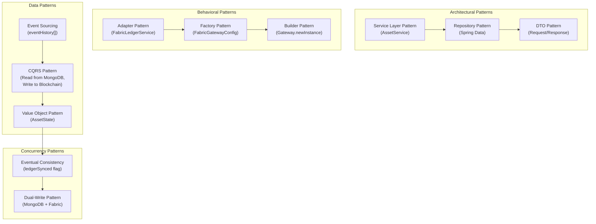

## Middleware Layer Class Diagram

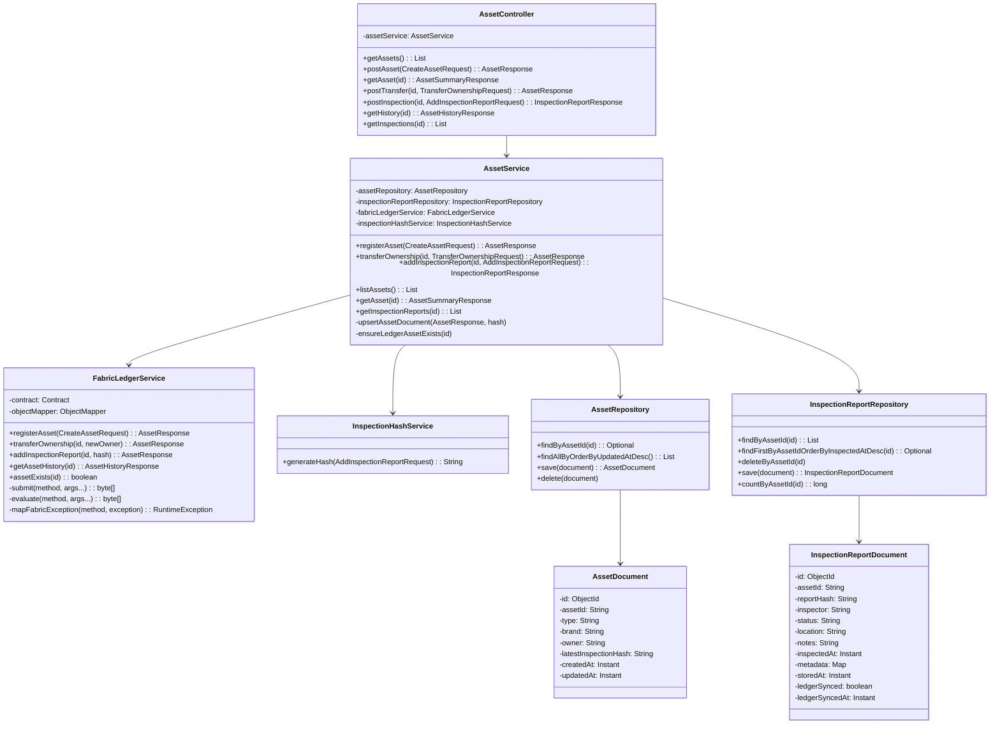

## Chaincode State Transition Diagram

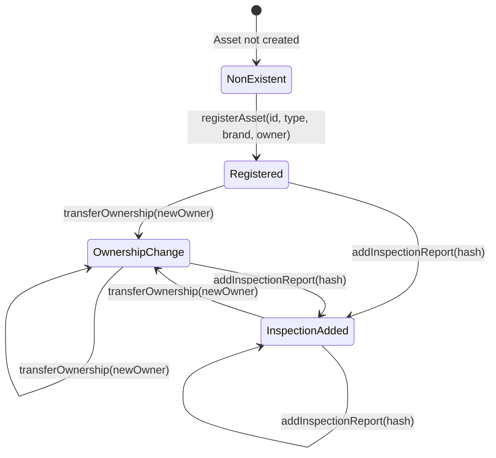

## Fabric Network Topology

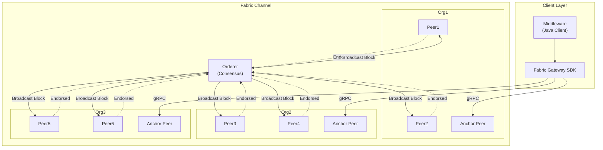

## Error Handling Flow

```mermaid
graph TD
    A["API Request"]
    B["Validate Request"]
    C{"Valid?"}
    D["Call Business Logic"]
    E["Execute Chaincode"]
    F["Blockchain Response"}
    
    B --> C
    C -->|Invalid| G["BadRequestException"]
    C -->|Valid| D
    D --> E
    E --> F
    
    F -->|Success| H["200 OK"]
    F -->|Duplicate| I["DuplicateAssetException<br/>→ 409 Conflict"]
    F -->|Not Found| J["ResourceNotFoundException<br/>→ 404 Not Found"]
    F -->|Other Error| K["FabricClientException<br/>→ 502 Bad Gateway"]
    
    G -->|GlobalExceptionHandler| L["400 Bad Request"]
    I -->|GlobalExceptionHandler| M["409 Conflict"]
    J -->|GlobalExceptionHandler| N["404 Not Found"]
    K -->|GlobalExceptionHandler| O["502 Bad Gateway"]
    
    H --> P["Return to Client"]
    L --> P
    M --> P
    N --> P
    O --> P
    
    style H fill:#90EE90
    style L fill:#FFB6C6
    style M fill:#FFB6C6
    style N fill:#FFB6C6
    style O fill:#FFB6C6
```
